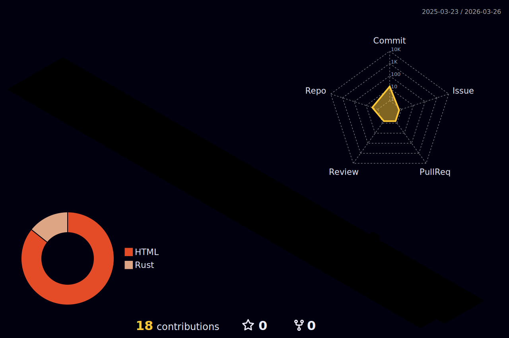

---

## GitHub Stats

---

## Trophies

---

## Space Shooter

> My contribution graph, reimagined as an arcade game. Updated daily via [gh-space-shooter](https://github.com/czl9707/gh-space-shooter).

---

## Contribution Snake

<picture>
  <source media="(prefers-color-scheme: dark)" srcset="assets/snake-dark.svg" />
  <source media="(prefers-color-scheme: light)" srcset="assets/snake.svg" />
  
</picture>

---

## 3D Contributions

---

## Latest Writing

<!-- BLOG-POST-LIST:START -->
- [Building in Public](https://christopherpaulmorrison.github.io/posts/building-in-public.html)
- [Lessons from Leading Teams](https://christopherpaulmorrison.github.io/posts/lessons-from-leading-teams.html)
- [The Art of Simplicity](https://christopherpaulmorrison.github.io/posts/the-art-of-simplicity.html)<!-- BLOG-POST-LIST:END -->

Read more at [christopherpaulmorrison.github.io](https://christopherpaulmorrison.github.io/)

---

